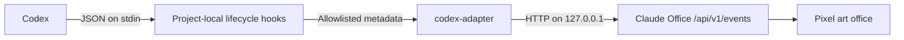

# Codex Integration

This guide describes the Windows-first integration between OpenAI Codex and Claude Office. It uses project-local Codex lifecycle hooks to pass allowlisted event metadata to a standalone adapter without modifying Codex or the VS Code extension.

## Table of Contents

- [Overview](#overview)
- [Why Lifecycle Hooks](#why-lifecycle-hooks)
- [Prerequisites](#prerequisites)
- [Project-Local Setup](#project-local-setup)
- [Architecture and Events](#architecture-and-events)
- [Security and Privacy](#security-and-privacy)
- [Failure Behavior](#failure-behavior)
- [Verify the Integration](#verify-the-integration)
- [Uninstall](#uninstall)
- [Troubleshooting](#troubleshooting)
- [Related Documentation](#related-documentation)

## Overview

The integration is designed to keep Codex and its editor extension unchanged:



The adapter endpoint is fixed to `http://127.0.0.1:8000/api/v1/events`. On Windows, the project hook runs:

```powershell
py -3.13 "$(git rev-parse --show-toplevel)\codex-adapter\hook.py"
```

The launcher loads the package directly from `codex-adapter/src`, so no package installation is required for project-local hooks.

## Why Lifecycle Hooks

Lifecycle hooks are preferred because they:

- provide session, turn, tool, and subagent events as they occur;
- use an official Codex extension point;
- do not require changes to Codex, the VS Code extension, or the existing global `notify` setting;
- can be scoped to this repository through `.codex/hooks.json`;
- avoid continuously parsing internal JSONL or SQLite formats;
- allow the adapter to discard sensitive fields before sending anything to Claude Office.

Codex hook behavior can evolve. Refer to the [official OpenAI Codex Hooks documentation](https://developers.openai.com/codex/hooks) when updating configuration or event handling.

## Prerequisites

Confirm that:

- Codex is installed and can open this repository;
- Python 3.13 is available through the Windows Python launcher;
- Claude Office can listen on `127.0.0.1:8000` when visualization is required;
- you trust the project-local hooks before enabling them.

```powershell
py -3.13 --version
```

## Project-Local Setup

### 1. Review the Existing Hook Configuration

The project-local configuration is `.codex/hooks.json`. It invokes `codex-adapter/hook.py` for:

- `SessionStart`
- `SessionEnd`
- `UserPromptSubmit`
- `PreToolUse`
- `PostToolUse`
- `SubagentStart`
- `SubagentStop`
- `Stop`

It also contains an existing `PreToolUse` entry for `graphify hook-check`. The adapter entry coexists with that unrelated hook.

### 2. Confirm the Adapter Command

The repository keeps both command fields for Windows and non-Windows environments:

```json
{
  "type": "command",
  "command": "python3 \"$(git rev-parse --show-toplevel)/codex-adapter/hook.py\"",
  "commandWindows": "py -3.13 \"$(git rev-parse --show-toplevel)\\codex-adapter\\hook.py\"",
  "timeout": 2
}
```

Preserve the surrounding event matchers and the existing `graphify hook-check` entry.

Do not add the same handlers to `~/.codex/hooks.json` unless user-wide behavior is intentional. Codex may merge user and project hook configurations, causing duplicate events.

### 3. Review and Trust the Hooks

Codex requires the project to be trusted before project-local hooks run. Open the hooks interface in Codex:

```text
/hooks
```

Review every displayed command, verify that it resolves to the expected adapter, and approve the project hooks only if the commands are trusted. Reopen the Codex session if the installed version does not reload hook changes immediately.

> **Security:** Project-local hook files execute commands locally. Review `.codex/hooks.json` again after pulling changes from another branch or remote repository.

## Architecture and Events

The adapter receives one JSON object on standard input for each hook invocation, maps its event name, and sends a minimized Claude Office event.

| Codex hook | Claude Office `event_type` | Allowlisted output |
| --- | --- | --- |
| `SessionStart` | `session_start` | envelope `session_id`; data `working_dir` from `cwd` |
| `SessionEnd` | `session_end` | `session_id` |
| `UserPromptSubmit` | `user_prompt_submit` | envelope `session_id`; fixed safe message |
| `PreToolUse` | `pre_tool_use` | envelope `session_id`; data `agent_id`, `tool_name`, `tool_use_id` when present |
| `PostToolUse` | `post_tool_use` | envelope `session_id`; data `agent_id`, `tool_name`, `tool_use_id` when present |
| `SubagentStart` | `subagent_start` | envelope `session_id`; data `agent_id`, `agent_type`, generated `agent_name` |
| `SubagentStop` | `subagent_stop` | envelope `session_id`; data `agent_id`, `agent_type` |
| `Stop` | `stop` | `session_id` |

The adapter may receive `turn_id`, `model`, and additional `cwd` values from Codex, but the initial allowlist deliberately does not forward them. It does not assume every hook contains every field. A direct parent-agent identifier was not present in the validated payload, so nested parent-child relationships require further validation.

Use `session_id` for the Codex/Claude Office session, `agent_id` for a subagent, and `tool_use_id` to pair tool start and completion. Use the hook receive time when the source payload lacks a suitable timestamp.

## Security and Privacy

Use an explicit allowlist. Construct a new event object from approved scalar metadata and ignore every unknown field.

The initial forwarded values are:

```text
session_id
agent_id
agent_type
tool_name
tool_use_id
cwd as SessionStart working_dir only
receive timestamp
```

Never log, persist, or forward values from prompts, input messages, tool input or response, assistant messages, commands, stdout, stderr, transcripts, file contents, authentication data, tokens, secrets, or API keys.

If diagnostics need to confirm a sensitive field exists, record only a boolean such as `tool_input_present: true`. Do not include its value, length, hash, excerpt, or structure.

Additional safeguards:

- send only to a configured loopback address by default;
- set short HTTP connection and response timeouts;
- avoid redirects to non-loopback destinations;
- keep diagnostic logging disabled by default;
- never copy Codex authentication files or environment secrets into adapter configuration;
- treat `cwd` as potentially sensitive and send it only when Claude Office needs it.

## Failure Behavior

The adapter must be fail-open: visualization failures must not interrupt Codex.

When Claude Office is stopped, unreachable, slow, or returns an error, the adapter should:

1. abandon delivery after a short timeout;
2. suppress normal stdout output;
3. avoid repeated or large stderr output;
4. avoid unbounded retries and queues;
5. handle all exceptions internally;
6. return a successful process exit status to Codex.

Events may be dropped while Claude Office is unavailable. This is preferable to delaying tool execution or a Codex turn. Durable replay is outside the minimal integration unless it can be added without storing sensitive data.

## Verify the Integration

After installing the adapter and updating `.codex/hooks.json`:

1. Start the Claude Office backend.
2. Open this repository in a new trusted Codex session.
3. Submit a harmless prompt that reads a non-sensitive project file.
4. Run one harmless tool action.
5. Start and complete one subagent task.
6. Confirm the office shows the main agent, tool activity, and subagent lifecycle.
7. Stop Claude Office and repeat a harmless Codex action.
8. Confirm Codex completes normally even though events cannot be delivered.

Do not use prompts, commands, or files containing credentials during verification. If debug output is enabled, inspect it for metadata keys only and remove temporary logs afterward.

## Uninstall

To disable this project's integration without affecting user-wide Codex settings:

1. Remove only handlers that invoke `claude_office_codex_adapter` from `.codex/hooks.json`.
2. Preserve unrelated handlers such as `graphify hook-check`.
3. Remove `codex-adapter/` if the adapter source itself is no longer needed.
4. Reopen Codex and use `/hooks` to verify that no Claude Office adapter command remains.

## Troubleshooting

### Hooks Do Not Run

**Likely causes:** The repository is not trusted, configuration was not reloaded, or an event name or matcher is invalid for the installed Codex version.

**Fix:**

1. Run `/hooks` in Codex.
2. Review and trust the project-local configuration.
3. Compare `.codex/hooks.json` with the official hooks documentation.
4. Start a new Codex session after changing the hook file.

### Python Launcher or Module Is Not Found

**Symptom:** The hook cannot run `py -3.13` or load `codex-adapter/hook.py`.

**Fix:** Confirm the interpreter and adapter installation:

```powershell
py -3.13 --version
py -3.13 "$(git rev-parse --show-toplevel)\codex-adapter\hook.py" < NUL
```

### Events Appear Twice

**Likely cause:** Equivalent handlers exist in both `.codex/hooks.json` and `~/.codex/hooks.json`.

**Fix:** Review `/hooks` and both scopes. Keep only the intended project-local adapter handler while preserving unrelated hooks.

### Tool Events Appear but Subagents Do Not

**Likely causes:** The installed Codex version does not emit the expected subagent hooks, the matcher differs, or no child agent was started.

**Fix:** Verify `SubagentStart` and `SubagentStop` in `/hooks`, then run a harmless task that explicitly delegates to one subagent. Do not infer subagent completion from a tool event alone.

### Claude Office Is Unavailable

**Expected behavior:** Codex continues normally and the visualization misses events generated during the outage.

If Codex pauses or fails, treat that as an adapter defect. Disable the adapter handlers in `.codex/hooks.json`, verify Codex operation, and inspect only sanitized diagnostic metadata.

### Event Fields Are Missing

Hook fields vary by event and Codex version. Omit absent optional fields instead of inventing values. If a required correlation key is missing, safely drop the event and record only a non-sensitive reason when debug logging is explicitly enabled.

## Related Documentation

- [Official OpenAI Codex Hooks documentation](https://developers.openai.com/codex/hooks)
- [Claude Office architecture](../architecture/ARCHITECTURE.md)
- [Claude Office quick start](../guides/quickstart.md)
- [Codex hooks research](../research/openai-codex-hooks.md)
